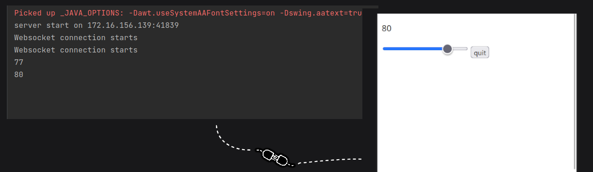

# Device WebSocket Interface

The Device WebSocket Interface is an interface that allows easy connections between different devices through a simple scanning process.

Your computer is powerful and can support you in your tasks such as rendering and playing games. However, your phone has additional functionalities such as a touch screen, a gyroscope, and a better camera.

Projects like [kde-connect](https://github.com/KDE/kdeconnect-kde) and other similar apps can achieve these functions, but they often require the installation of additional apps. Additionally, the connection process can be cumbersome and time-consuming. However, these projects are not developer-friendly as their primary focus is on providing runnable programs for users rather than offering interfaces.

This project offers another way to access these phone functions using your computer.

It creates a lightweight web server on your computer, allowing your devices to connect by scanning a QR code that contains the computer's address. The interface can receive and run web applications while communicating with the computer through WebSockets after being connected.

## Features

- Quick and easy connection
- Cross-platform compatibility
- Low latency

## Usage

To use the Device WebSocket Interface, you need to implement a web app (mostly consisting of HTML, CSS, and JS code) and an upper-class application. A demo version is provided in the `demo` folder.

In your upper-class program, follow these steps:
1. Start a server socket at localhost using any port number.
2. Run the interface by executing the command `java -jar interface.jar "web app folder" "port number"`.
3. Transfer and receive data to and from devices using the socket you created earlier.

Ensure that your devices and the computer are connected to the same network, and then scan the QR code displayed on the interface with your devices.

## Contributing

Issues, forks, and pull requests are welcome!

## License

This project is licensed under the [Unlicense](LICENSE).
